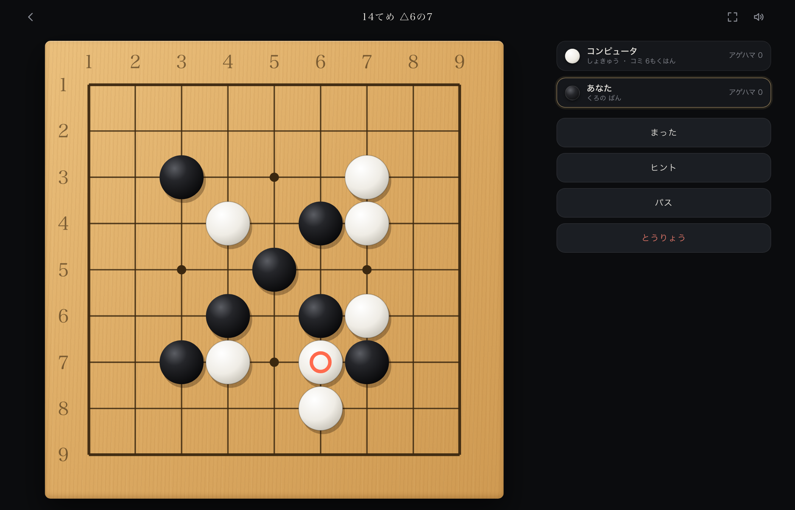
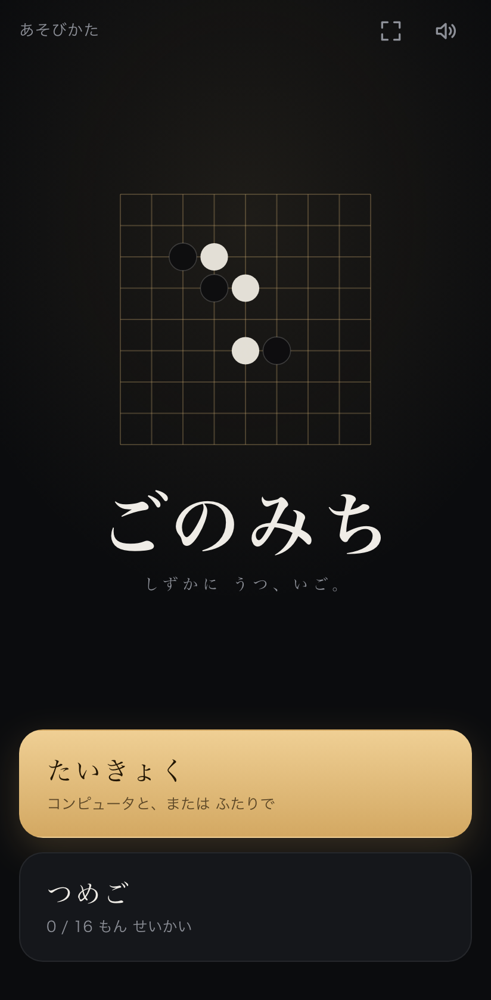
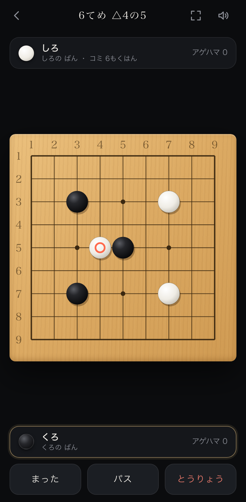

# ごのみち (Go no Michi)

A small, polished Go (囲碁) web app and installable PWA — play against a built-in AI or
pass-and-play with a friend, solve capturing puzzles, and learn the rules. The entire UI is
written in **hiragana and katakana only** (no kanji), so it also works as reading practice for
early Japanese learners. Dark, minimal design.

**Live:** [go.braunf.com](https://go.braunf.com/)



<p>
  
  
</p>

## Features

- **Play** on a 9×9, 13×13 or 19×19 board, against the built-in AI (入門/初級/中級, see below)
  or locally with a friend on one device.
- **Japanese rules scoring**: territory + prisoners, with a dead-stone marking phase after two
  passes (auto-suggested, and you can correct it) and configurable komi / handicap stones.
- **詰碁 (tsumego)**: 30 short capturing puzzles. Every puzzle is proven solvable in exactly the
  stated number of moves by an exhaustive game-tree solver (`src/tsumego/solver.ts`), not just
  authored by hand — see `src/tsumego/problems.test.ts`. New candidates can be generated and proven with
  `npx tsx scripts/gen-puzzles.ts`.
- **あそびかた**: an illustrated rules page (placing stones, liberties, capture, ko, scoring, dead stones and seki, handicap) for
  complete beginners.
- **せってい**: sound and vibration switches, clearing your record / puzzle progress / all saved data, and an
  about section.
- Move review/stepper after a finished game, **SGF export** (copy or download), an AI hint, an
  atari callout, and keyboard shortcuts on desktop (P twice to pass, U undo, H hint, arrows to
  step through a finished game's review, Esc to close dialogs).
- **Keyboard and screen-reader play**: Tab to the board, arrow keys move a cursor, Enter/Space places a stone (or
  toggles a group when marking dead stones); the cursor position, stone state, the computer's thinking and the
  result are announced. Dialogs trap focus, restore it when closed, and are labelled.
- **Positional superko**: a move that would recreate an earlier whole-board position is refused, so long ko cycles
  cannot go on forever.
- Games where you used 「まった」 (undo) or 「ヒント」 are marked as assisted and are not added to your record.
- **Up to 5 paused games** are kept (newest first on the home screen, each can be resumed or discarded).
- **Open an SGF** (file or pasted text; 9×9, 13×13, 19×19; legacy encodings such as Shift_JIS work) and step
  through it move by move, including variations (pick a branch where the game splits) and comments —
  「きふを ひらく」 on the home screen.
- The computer **resigns** (初級/中級) when its estimated win rate stays below 4% for three of its turns, after half
  the board is played.
- On 13×13 and 19×19, touch input is **tap to preview, tap again to place**, so a fingertip
  can't drop a stone on the wrong point. (Mouse: one click, as usual. 9×9: one tap.)
- SGF export includes the date; the downloaded file has an ASCII name (`gonomichi-YYYY-MM-DD.sgf`).
- Autosaves the game in progress (resume from the home screen) and keeps a simple win/loss
  record — both in `localStorage` only, nothing leaves your device. No analytics, no accounts,
  no third-party requests.
- **Installable PWA** that should work offline once visited. New versions are offered on the home
  screen ("こうしん") rather than swapped in silently mid-game.

## Supported browsers

Targets modern evergreen browsers. Only current Chromium and WebKit are tested; Safari/iOS 16 or newer
should work. The app uses module Web Workers, container queries and `100dvh`, so older browsers will not
lay out correctly.
Japanese text uses your system fonts (Hiragino / Yu Gothic / Noto Sans JP …). A small kana-only subset of Noto
Sans JP / Noto Serif JP (SIL Open Font License, `public/fonts/OFL.txt`) is bundled and used only for kana that
your system fonts lack, so devices without Japanese fonts still render correctly.

## Stack

Vite + React + TypeScript, no UI framework. The Go rules engine, scoring, the tsumego solver and
the AI are all plain, dependency-free TypeScript under `src/engine/`, `src/tsumego/` and
`src/ai/`. The AI is a small Monte Carlo tree search that runs in a Web Worker so the UI never
blocks; see `src/ai/mcts.ts`.

## Development

Requires Node `^20.19` or `>=22.12` (see `.nvmrc`).

```bash
npm ci
npm run dev              # dev server

npm run typecheck        # tsc over src, e2e, scripts and config files
npm test                 # vitest: engine, AI, storage, routing, and every tsumego puzzle (proved, not asserted)
npm run coverage         # same, with v8 coverage
npm run build            # typecheck + production PWA build

npx playwright install chromium webkit   # once, for the e2e tests
npm run e2e              # builds, then drives the built app in mobile/desktop × Chromium/WebKit

npm run arena            # AI-vs-AI strength check (slow)
npx tsx scripts/bench.ts # AI response time per board size

node scripts/make-icons.mjs        # regenerate PWA icons
node scripts/make-og-image.mjs     # regenerate the social share image (needs a Japanese serif font installed:
                                   #   Hiragino Mincho ProN, Yu Mincho or Noto Serif JP)
node scripts/make-screenshots.mjs  # regenerate the phone screenshots (needs `npm run preview` running)
npx tsx scripts/gen-puzzles.ts     # search for new, solver-proven tsumego candidates
```

CI (`.github/workflows/deploy.yml`) runs typecheck, unit tests, build and the e2e suite; the
site is deployed to GitHub Pages only when all of them pass on `main`.

## AI strength

The three levels (入門/初級/中級) are the same search given a larger time/playout budget — not
marketing names. `npm run arena` plays them against each other. In a small check on 9×9 (6 games per
pairing, colours alternating) the stronger level won every game: 中級 beat 初級 6/6, 初級 beat 入門 6/6 and 中級 beat 入門 6/6. On 13×13 (4 and 2 games) 初級 beat 入門 3/4 and 中級 beat 初級 2/2 — less decisive than on 9×9. 19×19 play
quality has not been measured. These are small samples. It is a lightweight search, not a strong engine like KataGo: expect it to play
more weakly, and more slowly, on 19×19, and expect its strength to vary with how fast your device is
(each move is time-capped).

## Known limitations

- The AI itself only knows simple ko inside its search (the game engine refuses repetitions and tells the AI which
  points are banned). Its strength is time-capped, so it varies with device speed.
- Dead stones are suggested by playouts and may be wrong; correct them by tapping before scoring.
  Seki is scored correctly only if you mark nothing dead in it.
- SGF import reads the first game in a file, only 9/13/19 boards, and ignores board markup (labels, triangles …).
- GitHub Pages cannot set HTTP headers, so the Content-Security-Policy is a `<meta>` tag (no `frame-ancestors`) and
  cache lifetimes are GitHub's defaults (10 minutes).
- Online/networked play is intentionally out of scope.
- Automated tests run in headless Chromium and WebKit. Real iOS and Android devices (including offline use) have
  been checked by hand; offline *reload* is automated on Chromium only (Playwright's WebKit can't do it), so on
  WebKit the tests check the service-worker cache contents instead.

## Contributing / security

See [CONTRIBUTING.md](CONTRIBUTING.md) and [SECURITY.md](SECURITY.md). Changes are listed in
[CHANGELOG.md](CHANGELOG.md).

## License

[MIT](LICENSE)
